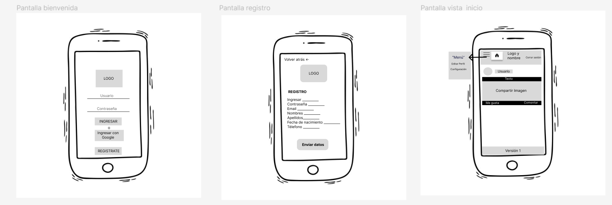
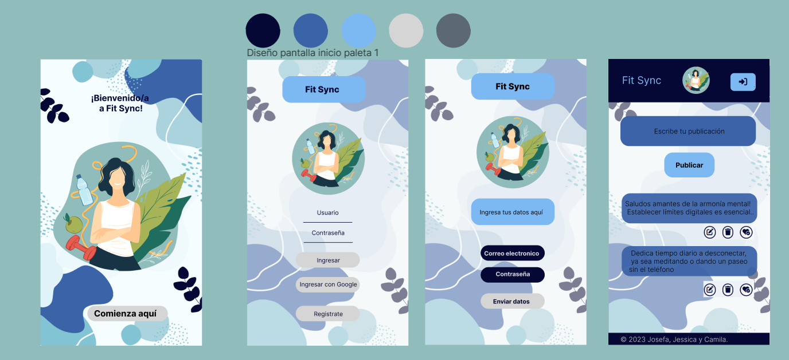
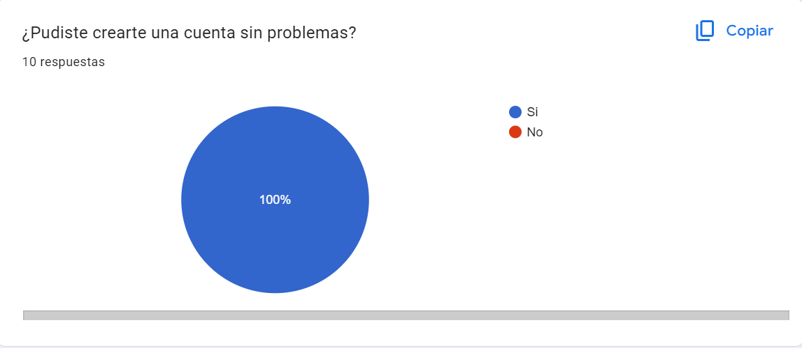
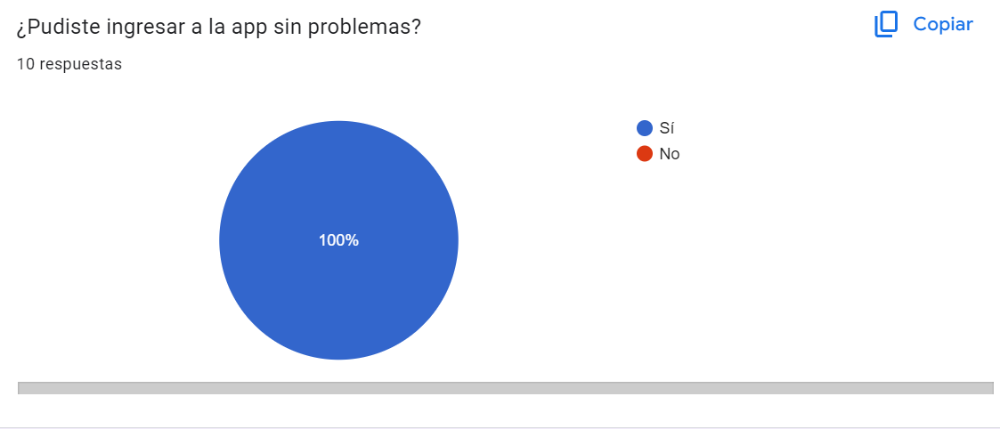
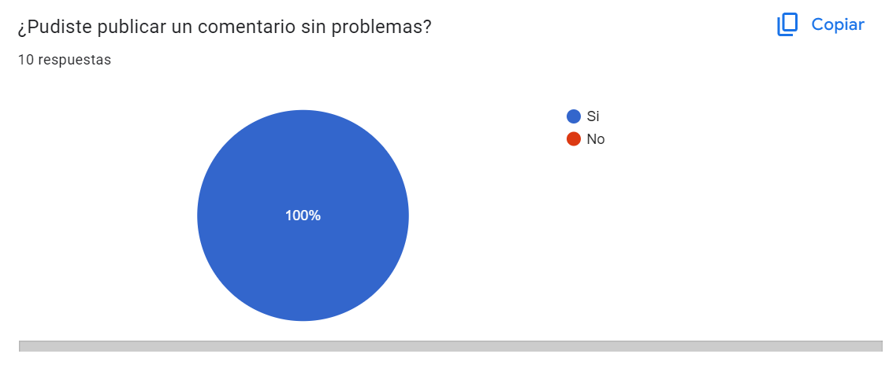
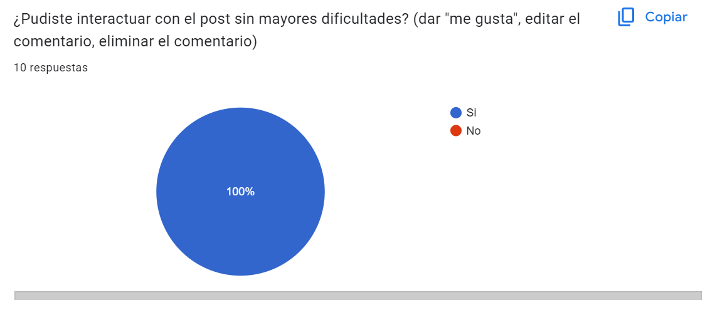
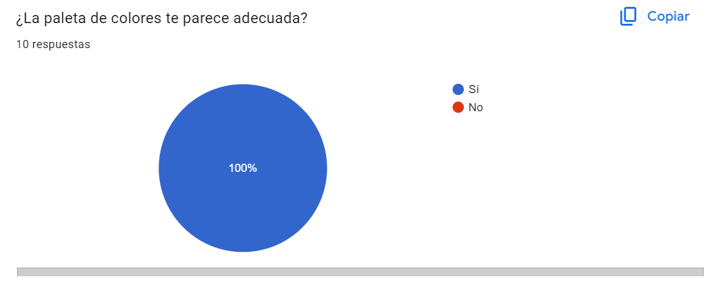
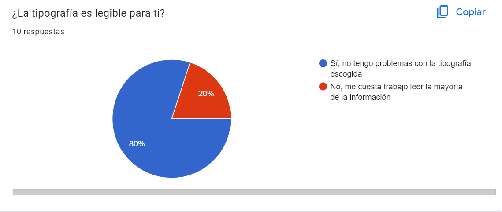
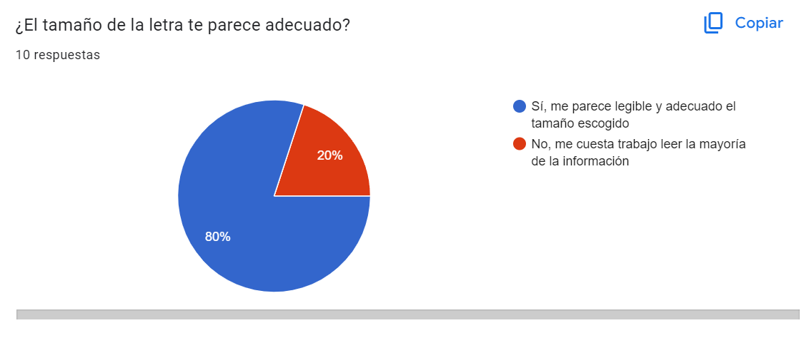
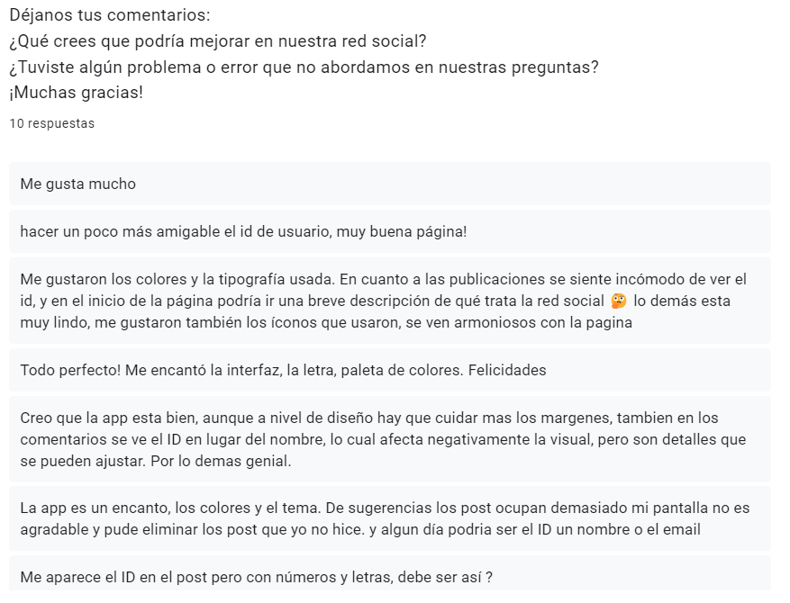

# FIT SYNC - Documentación

## Introducción

FIT SYNC es una aplicación diseñada para proporcionar a las usuarias la capacidad de crear una cuenta personalizada y acceder fácilmente a una plataforma centrada en el deporte y el estilo de vida activo. Dentro de la aplicación, las usuarias pueden compartir publicaciones relacionadas con estos temas, explorar contenido diverso y formar parte de una comunidad dedicada a fomentar un estilo de vida saludable y activo.

## Resumen del Proyecto

FIT SYNC se construye como una Aplicación de Página Única (SPA) con capacidad responsive. La autenticación de usuarios y el almacenamiento de la base de datos de publicaciones se gestionan a través de Firebase. Las usuarias pueden iniciar sesión mediante Google o creando una cuenta con su dirección de correo electrónico. Además de la capacidad para realizar publicaciones, las usuarias pueden editar y eliminar sus propias publicaciones, así como interactuar con otras mediante la opción de "Me gusta".

## Historias de Usuario

Hemos realizado una encuesta para recopilar opiniones sobre las preferencias de los usuarios en relación a nuestro proyecto.
https://forms.gle/Y6FYio8oDXUgaY726
Los resultados han proporcionado información que guiará el diseño y desarrollo de nuestra plataforma.

### 1. Registro de Usuario
#### Historia de Usuario 1
**Como:** Persona interesada en una nueva app de deporte y vida activa  
**Quiero:** Poder registrarme de distintas formas, con Google o email  
**Para:** Poder crearme un perfil  

### 2. Publicación y Visualización de Contenido
#### Historia de Usuario 2
**Como:** Usuario/a interesado/a en implementar hábitos saludables  
**Quiero:** Poder crear y visualizar posts de personas compartiendo datos e ideas de vida activa  
**Para:** Motivarme y ponerlos en práctica  

### 3. Edición de Publicaciones
#### Historia de Usuario 3
**Como:** Persona registrada en la app de deporte y vida activa  
**Quiero:** Ser capaz de editar los posts  
**Para:** Corregir errores de ortografía u otros  

### 4. Interacción Social
#### Historia de Usuario 4
**Como:** Persona registrada en la app de deporte y vida activa  
**Quiero:** Ser capaz de dar “me gusta” a los posts y también de quitarlos  
**Para:** Interactuar con otros usuarios

  
### 5. Prototipo de baja de fidelidad

### 6. Prototipo de alta de fidelidad

### 7. Testeos de usabilidad 

Se llevó a cabo una encuesta para recopilar información sobre la experiencia de los usuarios al utilizar la aplicación, la cual arrojó resultados positivos en cuanto a la interacción de las personas con la app. Se observó que no se encontraron errores al momento de crear una cuenta, publicar un comentario y realizar interacciones como dar "me gusta", editar o eliminar comentarios.

La encuesta también reveló la necesidad de implementar mejoras futuras, como ocultar el ID del comentario, ya que afecta la experiencia visual de los usuarios. Además, se sugiere la posibilidad de restringir la capacidad de eliminar comentarios, permitiendo únicamente a los usuarios eliminar aquellos que ellos mismos hayan creado.

A continuación, se presentan los resultados de las preguntas realizadas en la encuesta:

